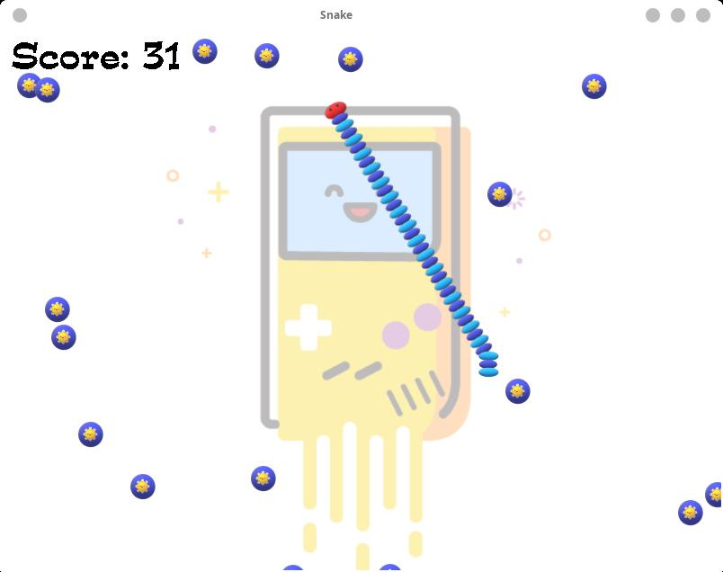

# Simple Snake Game

This is a simple snake game which written with C++ and SDL2.



## Prerequisite
Some libraries are required by this project.
They are:

1. [SDL2](https://www.libsdl.org/)
2. SDL2_image
3. SDL2_ttf
4. SDL2_mixer

## Build
For linux platform, please:
```bash
# create build directory
mkdir build
cd build

# build
cmake ..
make

# start
cd ../
./snake
```


## How do I control the little snake?
__Button__ `←`  or  `A`__:__ turn left 

__Button__ `→`  or  `D`__:__ turn right

